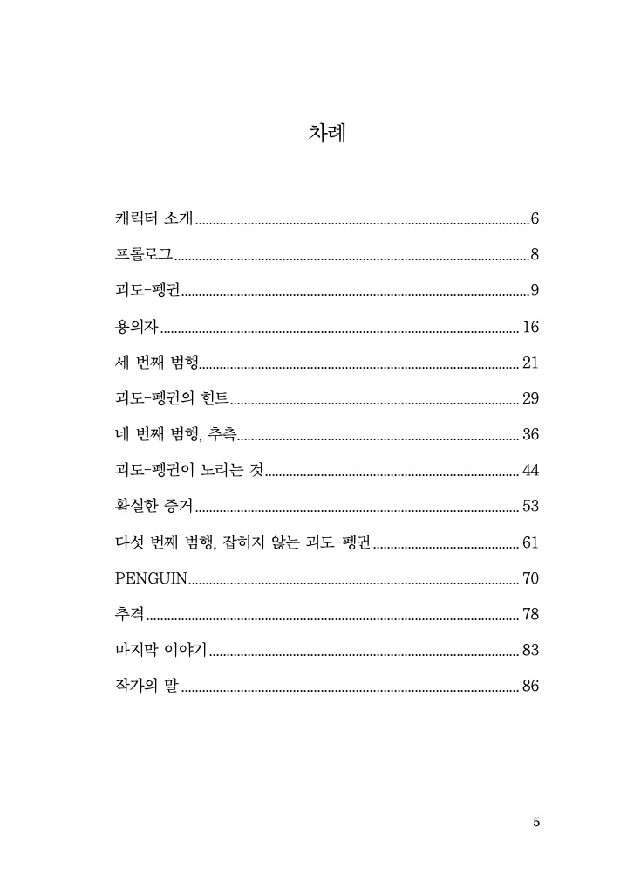
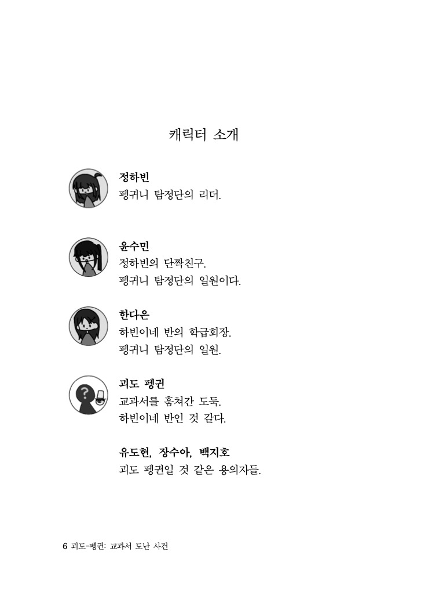
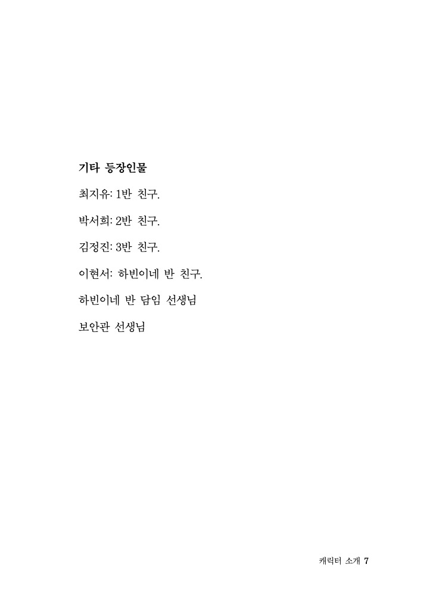
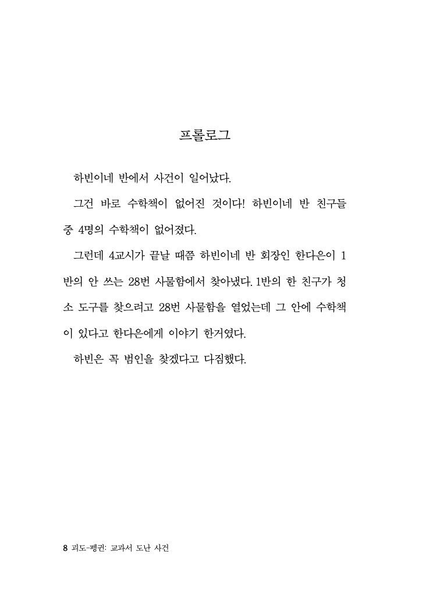
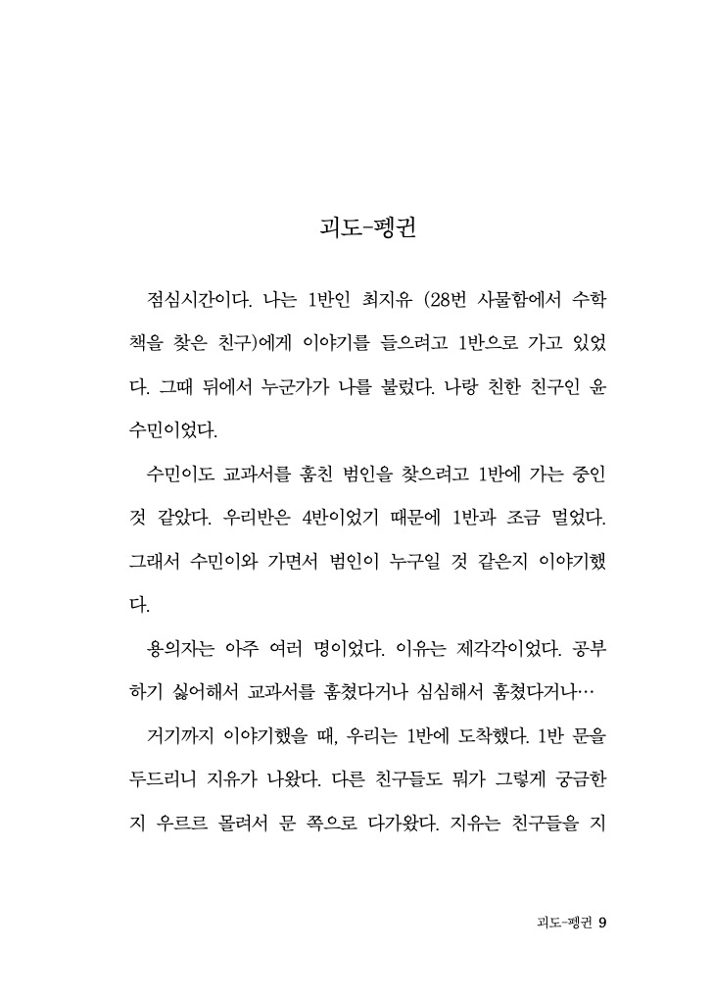
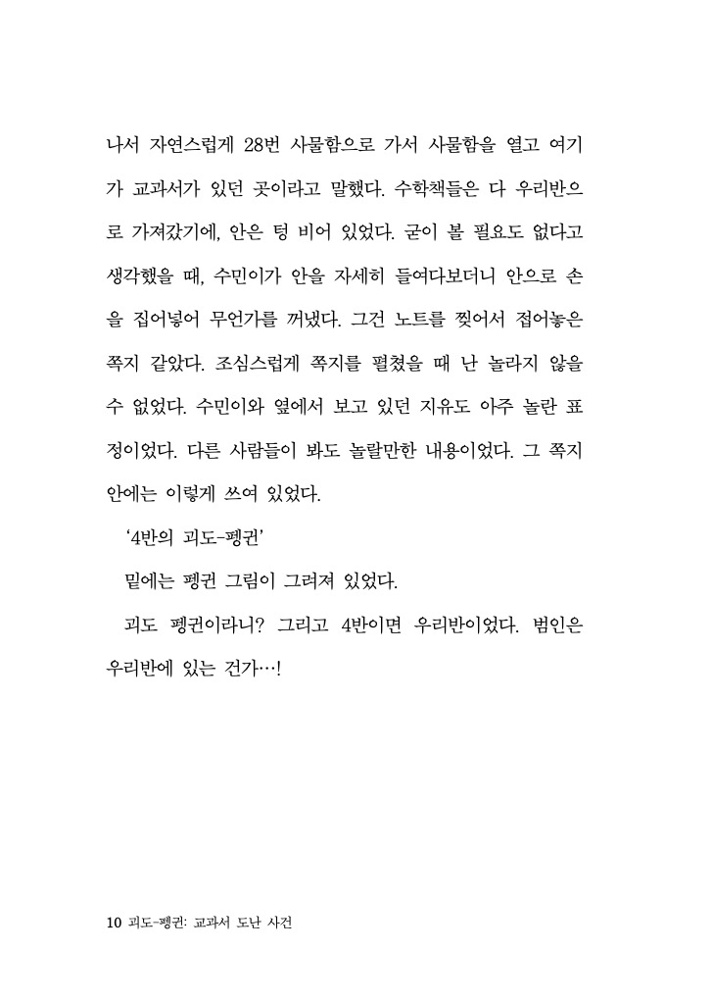
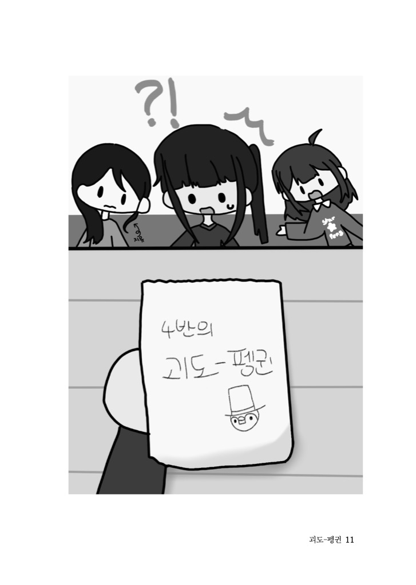

# 괴도-펭귄 교과서 도난 사건

## 구매처
### 전자책
 - [YES24](https://www.yes24.com/product/goods/170652463)
 - [알라딘](https://www.aladin.co.kr/shop/wproduct.aspx?ItemId=387147888)
 - [밀리의서재](https://www.millie.co.kr/v4/book/75a1d1bd0a834933)

### 종이책

 - [YES24](https://www.yes24.com/product/goods/154230485)
 - [알라딘](http://aladin.kr/p/kC9u2)
 - [부크크](https://bookk.co.kr/bookStore/68c1575fcae1f08cbb8d8816)
 - [교보문고](https://product.kyobobook.co.kr/detail/S000218135598)
 - [영풍문고](https://www.ypbooks.co.kr/books/202509222740835161)
 - [쿠팡](https://www.coupang.com/vp/products/9069347313?itemId=26634395262&vendorItemId=93607177675&q=%EA%B4%B4%EB%8F%84+%ED%8E%AD%EA%B7%84+%EA%B5%90%EA%B3%BC%EC%84%9C+%EB%8F%84%EB%82%9C+%EC%82%AC%EA%B1%B4&searchId=f450df275117645&sourceType=search&itemsCount=35&searchRank=0&rank=0&traceId=mh607jbi)

부크크를 통한 POD (Print on demand) 책으로, 배송에 일주일 정도 걸릴 수 있습니다.

## 개요

교과서를 훔쳐가는 도둑, '괴도-펭귄'.  
하빈이와 친구들이 괴도-펭귄을 잡으려 하지만, 괴도-펭귄의 범행은 계속 된다.  
하빈이는 과연 괴도-펭귄을 잡을 수 있을까?  
초등학생 작가가 쓴 초등학생을 위한 추리 소설.  

## 미리 보기

 
 
 
 
 
 
 
 
 