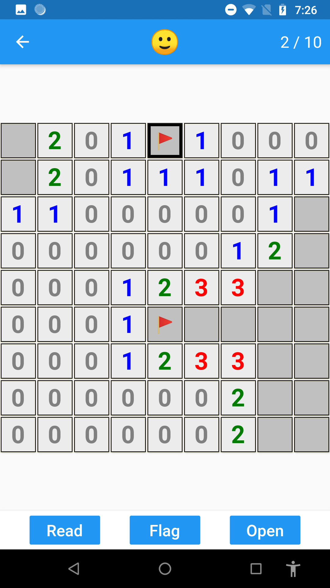
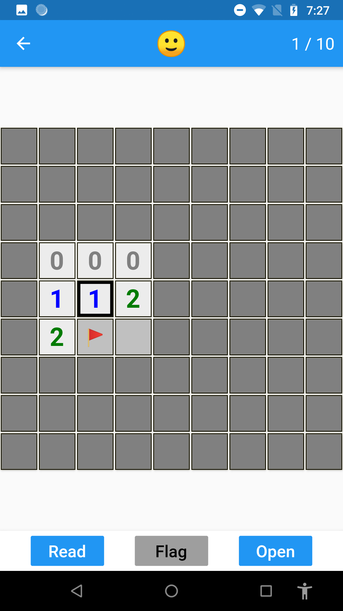
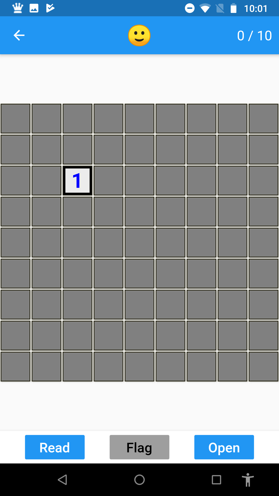
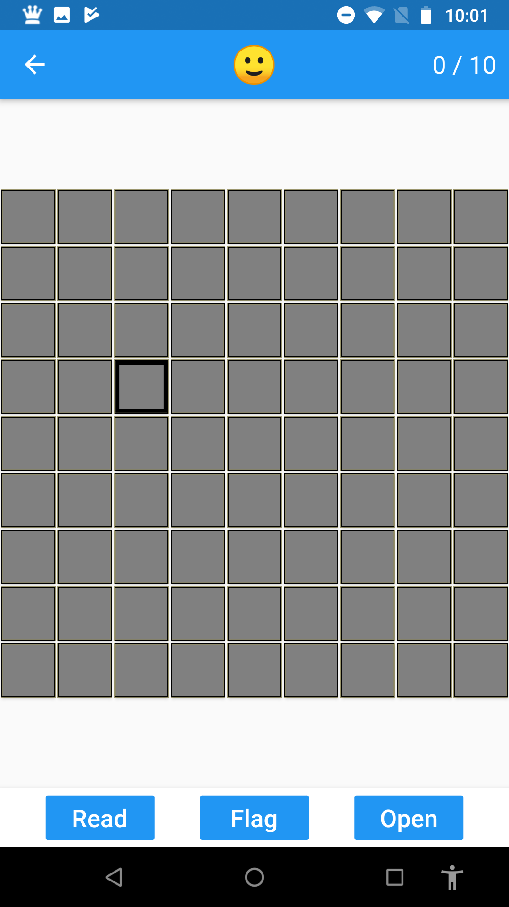

# Minesweeper in the dark

[\[English\]](index)

*Fully accessible Minesweeper.*  
*Can you play Minesweeper only with Audio feedback?*

## Download
 - Android - [com.android.mindsweeper2-1.0.0.apk](com.android.mindsweeper2-1.0.0.apk)
 - iOS

## History
 - 2019-09-06 1.0.0 is released.
 - 2019 I decided to remake it for Mobile platforms.
 - 2005 I made a [Minesweeper](https://github.com/keewon/blindmine) which runs on PC for visually impaired people. 

## Related works
 - [Accessible Minesweeper](https://apps.apple.com/us/app/accessible-minesweeper/id405094331)

## Note
 - Software
   - We use Flutter

## Screenshots

## Feedback
Please leave your feedback on any channel - app store, hacker news and [twitter](https://twitter.com/keewonseo)
 

[Privacy](privacy)
