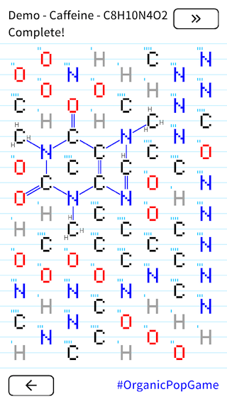
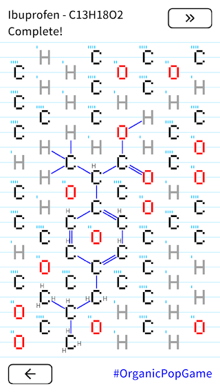

# Organic Pop

[\[English\]](index) [\[Korean\]](index_ko)

*Organic Chemistry met Tile-matching puzzle.*  
*Build a Molecule to eliminate Atom blocks!*

 

## Game Rules
 1. Connect atoms. Octet-rule apply here.
 2. Atoms disappear when connected atoms form a molecule.
 3. Repeat 1-2 until you build a target molecule.

## Download
 - Android : [Google Play Store](https://play.google.com/store/apps/details?id=com.acidblob.opop1)
 - iOS : [App Store](https://itunes.apple.com/kr/app/organic-pop/id1317691271?mt=8)

## History
 - 2018-03-05 1.0.5 has been released with **Undo** and Vitamins.
 - 2018-01-27 Introduced at the lightning talk of [2nd Mad Science Festival](https://madscientist.wordpress.com/2018/01/31/2%EB%B6%84%EC%9D%98-%EB%A7%88%EB%B2%95%EA%B3%BC-%EB%8F%8C-%EC%88%98%ED%94%84%EC%9D%98-%EB%B9%84%EB%B0%80-%EC%A0%9C-2%ED%9A%8C-%EB%A7%A4%EC%82%AC%ED%8E%98-%ED%9B%84%EA%B8%B0/)
 - 2017-12-21 1.0.4 has been released for both of Android and iOS platforms with newly added 20 Amino acids.
 - 2017-12-01 iOS version has been released.
 - 2017-11-25 1.0 for Android has been released. Submitted to [GIGDC](http://www.gigdc.or.kr/), but not accepted.
 - 2017-06-12 Submitted to [BIC2017](https://bicfest.org/), but not accepted.
 - 2016-11-24 First prototype is developed in a night.

## Related works
 - The main idea of the first prototype was "Connect and destroy". It was not enough. I have added "Build and Collect" into this game after playing [Pokemon Go](https://www.pokemongo.com/) and [Euclidea](https://www.euclidea.xyz/). Collect your organic compounds as you collect Pokemons!
 - After I had completed prototype, I found this game - [Molecules, a chemistry game](https://itunes.apple.com/us/app/molecules-a-chemistry-game/id910014218?mt=8). The mechanism is similar. "Hexagonal structure" and "Touch to cancel" are concepts from that game.

## Note
 - Software
   - [Gideros](https://github.com/gideros/gideros) is a cross-platform mobile development environment and it is used for this game.
   - [InChI](http://www.inchi-trust.org/) key and the software are used for internal algorithm.
 - Data and text
   - Most chemistry data are from [PubChem](https://pubchem.ncbi.nlm.nih.gov/), and some are from Wikipedia. I deeply appreciate it.
 - Font
   - We use Gideros default font and [Google Noto Fonts](https://www.google.com/get/noto/)
 - Sound
   - Merge: https://www.freesoundeffects.com/free-track/electricshock-426768/
   - Spark: https://www.freesoundeffects.com/free-track/arrow-swoosh-1-466463/
   - Pop: It's from my mouth.

## Screenshots
  

## Discussion
Please leave your feedback here or to https://twitter.com/keewonseo


