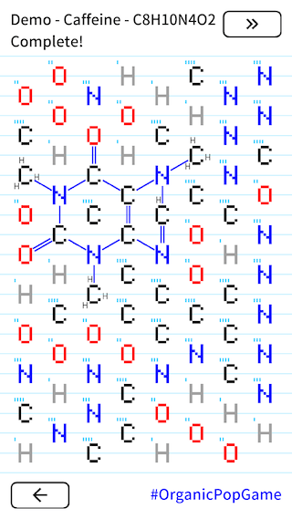
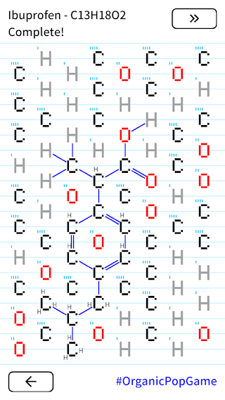

# Organic Pop - 오가닉팝

[\[English\]](index) [\[Korean\]](index_ko)

*유기화학이 퍼즐 게임을 만났습니다. 원자 블록을 없애려면 분자를 만드세요!*



## 게임 방법
 1. 원자를 연결합니다. 옥텟 규칙이 적용됩니다.
 2. 연결된 원자가 분자를 이루면, 원자가 사라집니다.
 3. 목표 분자를 만들 때까지 1-2 를 반복합니다.

## 다운로드

## 기록
 - 2020-01-12 1.2.0 - 커스텀 레벨, 백업/복구, ATP 등 생화학 관련 분자 추가, 일본어 텍스트 지원
 - 2019-03-25 [Facebook Page](https://www.facebook.com/OrganicPopGame/) 를 만들었습니다.
 - 2018-11-22 1.1.1 - 점퍼, 페이지, 힌트, Morphine, Tannic acid 등
 - 2018-03-05 1.0.5 가 나왔습니다. Vitamin과 되돌리기 기능이 추가되었습니다.
 - 2018-01-27 [2nd Mad Science Festival](https://madscientist.wordpress.com/2018/01/31/2%EB%B6%84%EC%9D%98-%EB%A7%88%EB%B2%95%EA%B3%BC-%EB%8F%8C-%EC%88%98%ED%94%84%EC%9D%98-%EB%B9%84%EB%B0%80-%EC%A0%9C-2%ED%9A%8C-%EB%A7%A4%EC%82%AC%ED%8E%98-%ED%9B%84%EA%B8%B0/) 의 라이트닝 토크에서 소개되었습니다.
 - 2017-12-21 1.0.4 가 나왔습니다. 20개의 아미노산이 추가되었습니다.
 - 2017-12-01 iOS 버전이 나왔습니다.
 - 2017-11-25 Android 버전이 나왔습니다. [GIGDC](http://www.gigdc.or.kr/)에 도전했으나 탈락했습니다.
 - 2017-06-12 [BIC2017](https://bicfest.org/)에 도전했으나 탈락했습니다.
 - 2016-11-24 첫 프로토타입을 하룻밤만에 만들었습니다.

## 관련 작품
 - 최초 컨셉은 연결하여 없애기였으나, 그것으로는 부족했습니다. [Pokemon Go](https://www.pokemongo.com/)와 [Euclidea](https://www.euclidea.xyz/) 를 플레이하면서 만들고 모으는 컨셉을 추가했습니다. 포켓몬을 모으듯이 유기화합물을 모으세요!
 - 프로토타입 개발 후 [Molecules, a chemistry game](https://itunes.apple.com/us/app/molecules-a-chemistry-game/id910014218?mt=8)를 발견했습니다. 동작 방식은 비슷합니다. 육각 구조와 터치하여 취소하기는 이 게임에서 가져온 것입니다.

## 알림
 - 소프트웨어
   - [Gideros](https://github.com/gideros/gideros)는 멀티플랫폼 모바일 개발 환경입니다. 게임을 만드는 데에 사용했습니다.
   - [InChI](http://www.inchi-trust.org/) key and the software are used for internal algorithm.
 - 자료, 문구
   - 화학 데이터는 [PubChem](https://pubchem.ncbi.nlm.nih.gov/)과 Wikipedia 에서 가져다 썼습니다. 많은 신세를 졌으며 매우 감사합니다.
 - 글꼴
   - Gideros 기본 글꼴과 [Google Noto Fonts](https://www.google.com/get/noto/)를 사용합니다.
 - 소리
   - 합치기: https://www.freesoundeffects.com/free-track/electricshock-426768/
   - 없애기: https://www.freesoundeffects.com/free-track/arrow-swoosh-1-466463/
   - Pop: 입으로 낸 소리입니다.

## 스크린샷
 

## 피드백
편하신 채널로 피드백을 남겨주세요 - 스토어, [Facebook](https://www.facebook.com/OrganicPopGame/) 아니면 [Twitter](https://twitter.com/keewonseo)

[Privacy](privacy)
